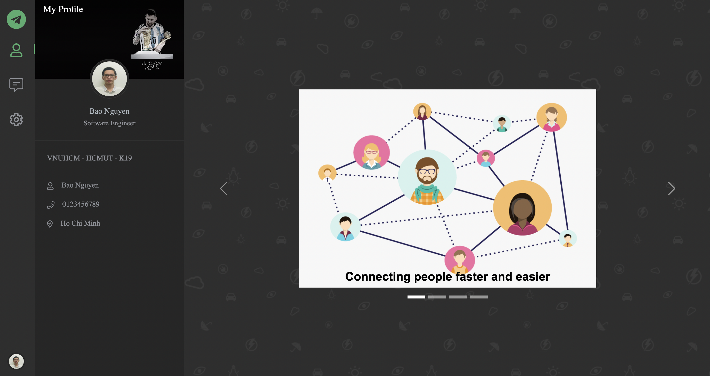
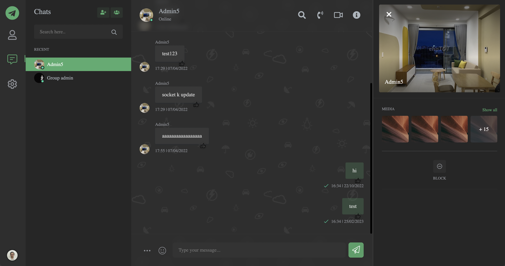
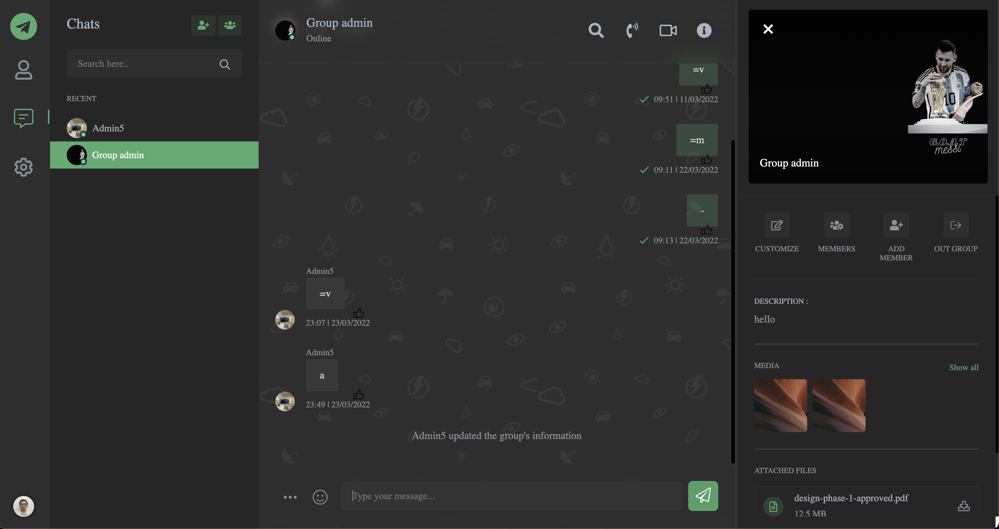
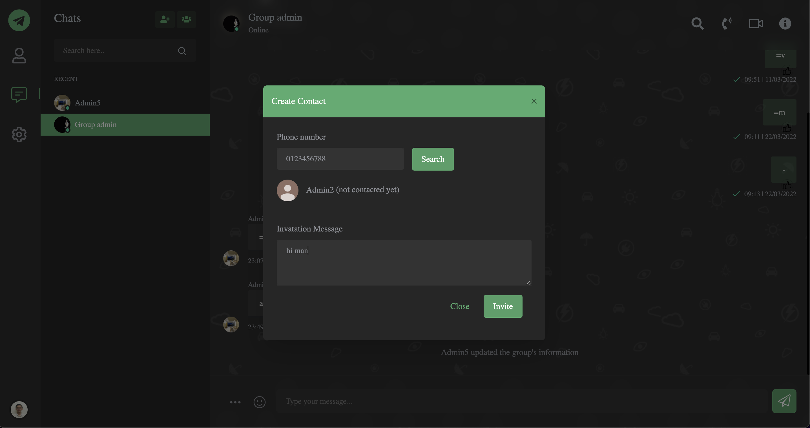
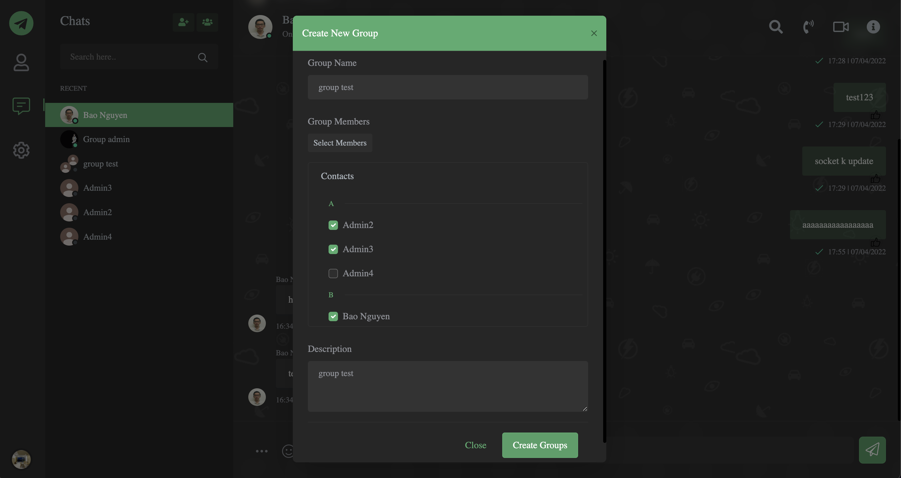

## Chat App

## 

## 🤖 Features

-   Login, register.
-   View and update personal information: fullname, address, description, avatar.
-   Create a new contact and new group.
-   Display the number of unread messages and unread conversations.
-   User is online or offline.
-   A message of likes and dislikes.
-   Text-based message.
-   Use paging for load messages.
-   Conversation single:
    -   View his/her personal information.
-   Conversation group:
    -   Update the group's name, avatar and description.
    -   See the list of group members.
    -   Add new member to group.
    -   Have the conversation's notification message.
    -   Out group.

## 🤖 Tech stacks

### Back-end

-   Node.js (Express.js)
-   MongoDB (Mongoose)
-   Socket IO, JWT

### Front-end

-   Handlebarsjs (Template engine)
-   HTML5, CSS, Javascript
-   Clone from: https://doot-dark.react.themesbrand.com/dashboard

### Deploy

-   Docker, Kubernetes for deployment
-   Nginx for reverse proxy, Cloudflare for SSL cert
-   CI/CD with Jenkins

#### Link demo: <a href="https://chat-app.baonk.site" target="_blank">https://chat-app.baonk.site</a>

-   Account: admin1/admin1, admin2/admin2, admin3/admin3

### Screenshots

|          Home Page          |
| :-------------------------: |
|  |

|              User infor               |
| :-----------------------------------: |
|  |

|            Single conversation             |
| :----------------------------------------: |
|  |

|            Group conversation             |
| :---------------------------------------: |
|  |

|            New Contact             |
| :--------------------------------: |
|  |

|            New Group             |
| :------------------------------: |
|  |

#### See this repository for more information about my setup: <a href="https://github.com/bao-nguyen-khac/devops-setup" target="_blank">https://github.com/bao-nguyen-khac/devops-setup</a>
