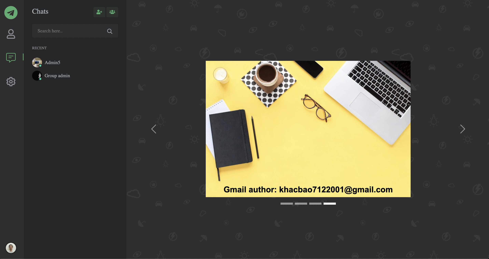

## Chat App

## 

## 🤖 Features

-   Login, register.
-   View and update personal information like: fullname, address, description, avatar.
-   Create new contact or new group.
-   Show unread conversation and number of messages unread.
-   Online or offline user.
-   Like and dislike message.
-   Message as text.
-   Use paging for message.
-   Conversation single:
    -   View his/her personal information.
-   Conversation group:
    -   Update the group's name, avatar and description.
    -   View list members in group.
    -   Add new member to group.
    -   Notification message of the conversation.
    -   Out group.

## 🤖 Tech stacks

### Back-end

-   Nodejs (Expressjs)
-   MongoDB (Mongoose)
-   Socket IO

### Front-end

-   HTML5
-   CSS (Bootstrap 5)
-   Javascript
-   Handlebarsjs (Template engine)

### Deploy

-   Docker
-   Nginx
-   Cloudflare (SSL cert)

### Link demo: <a href="https://chat-app.baonk.site" target="_blank">Chat app</a>

-   username: admin1 (admin 2)
-   password: admin1 (admin 2)

### Screenshots

|          Home Page          |
| :-------------------------: |
|  |

|              User infor               |
| :-----------------------------------: |
|  |

|            Single conversation             |
| :----------------------------------------: |
|  |

|            Group conversation             |
| :---------------------------------------: |
|  |

|            New Contact             |
| :--------------------------------: |
|  |

|            New Group             |
| :------------------------------: |
|  |
